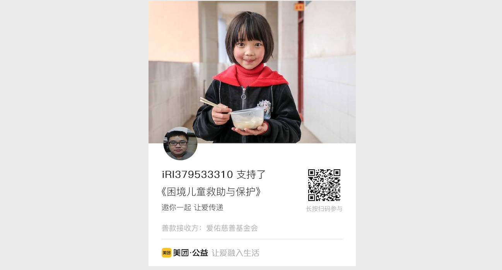
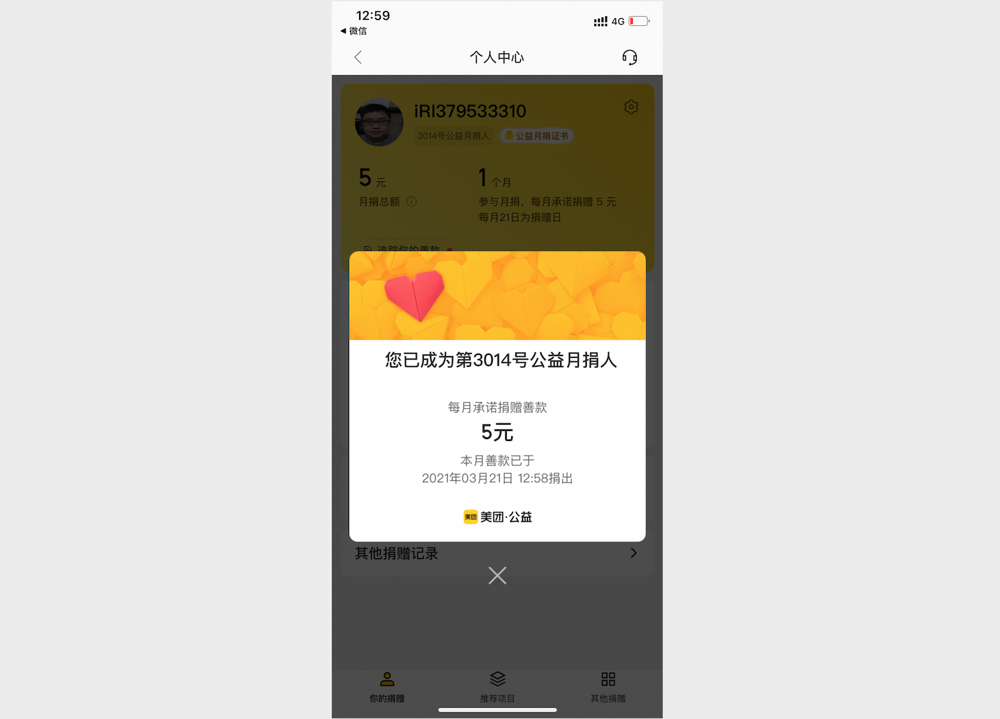
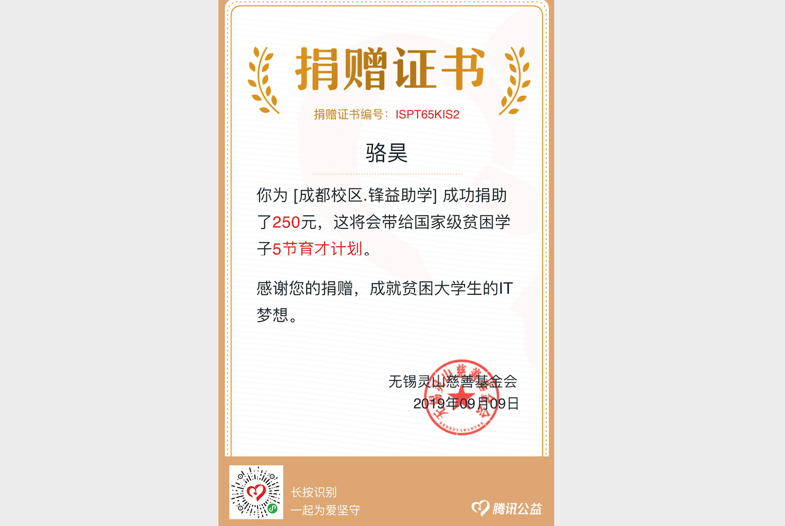

## Güncelleme Günlüğü

> **Translated to Turkish by** himmetcanumutlu

### 7 Aralık 2025

1. Bazı kaynak dosyalarındaki ve dokümanlardaki sorunları güncelledim.
2. Herkesin en çok okuduğu 《Python Öğrenme Kaynakları Özeti》ni güncelledim.

### 4 Mart 2025

1. Python veri analizi bölümünün kodlarını ve kaynaklarını ekledim.
2. Dokümanlardaki bazı yazım hatalarını ve geçersiz bağlantıları düzelttim.

### 18 Şubat 2025

1. Matematik formüllerinin görüntülenememesi sorununu çözdüm.
2. Makine öğrenmesi bölümünün dokümanlarını düzeltip tamamladım.

### 30 Ocak 2025

1. 01-20. Gün 《Python Dili Temelleri》 bölümünün içeriğini güncelledim.
2. 21-30. Gün 《Python Dili Uygulamaları》 bölümünün içeriğini güncelledim.
3. Projenin dizin yapısını düzenledim.
4. Bazı kaynak dosyalarındaki sorunları düzelttim.

### 22 Ocak 2025

1. 《Makine Öğrenmesi》 bölümünün içeriğini tamamladım.
2. Bazı dokümanlardaki hataları güncelledim.
3. Derin öğrenme içeriklerini keşfetmek için yeni bir proje başlattım.

### 18 Nisan 2024

1. Proje yapısını yeniden düzenleyip bir kısım dokümanı tamamladım.
2. 《Makine Öğrenmesi ve Derin Öğrenme》 bölümünün içeriğini yazmaya hazırlanmaya başladım.

### 11 Ocak 2022

1. Yakın zamanda aldığım bağışları Shuidichou ve Zhongyuan Puji Kamu Yararı Hayırseverliği Teşvik Derneği aracılığıyla ihtiyaç sahiplerine bağışladım.

    

### 22 Kasım 2021

1. Veritabanı bölümünün doküman ve kodlarını güncelledim.
2. Kullanıcıların belirttiği doküman ve kod hatalarını düzelttim.
3. README dosyasındaki grup bilgilerini güncelledim.

### 7 Ekim 2021

1. Proje dizin yapısını düzenledim.
2. Veri analizi bölümünün içeriğini güncelledim.

### 28 Mart 2021

1. Son zamanlarda veri madenciliği konusunu baştan sona gözden geçirdim; doküman yazmaya hazırlanıyorum.

2. Yakın zamanda aldığım bağışları Meituan Kamu Yararı aracılığıyla ihtiyaç sahiplerine bağışladım.

    

    

    

### 3 Ekim 2020

1. Proje dizin yapısını düzenledim.
2. Önceki eksik içerikleri tamamlamaya ve son bölümleri güncellemeye başladım.
3. Yakın zamanda aldığım bağışları Shuidichou gibi platformlar aracılığıyla yardıma ihtiyacı olanlara bağışladım.

### 12 Temmuz 2020

1. Bazı dokümanlardaki hataları düzelttim.

2. Django bölümünün dokümanlarını güncelledim.

3. Yakın zamanda aldığım bağışları Shaanxi Geri Dönen Çocuklar Yardım Merkezi'ne bağışladım.

    

### 8 Nisan 2020

1. Temel bölümü (1. Günden 15. Güne) "Python-Core-50-Courses" adlı yeni bir depoya taşıyıp içeriğin bir kısmını güncelledim.

2. README.md dosyasını güncelledim.

3. Yakın zamanda aldığım bağışları Tencent Kamu Yararı aracılığıyla "Çocuk Sağlığı Sınıfı"na destek olmak için bağışladım.

   

### 8 Mart 2020

1. Son 10 günün dokümanlarının bir kısmını güncelledim.

2. Yakın zamanda aldığım bağışları Meituan Kamu Yararı aracılığıyla salgından etkilenen çocuklara bağışladım.

   

### 1 Mart 2020

1. Projedeki bazı görsel kaynaklarını optimize ettim.
2. Bazı dokümanları güncelledim.

### 23 Eylül 2019

1. Milli bayram tatili bitmeden 91. Günden 100. Güne kadar olan içeriklerin güncellemesini, en güncel Python mülakat soruları derlemesi de dâhil olmak üzere tamamlamayı planlıyorum.
2. 7. Gün 《String ve Yaygın Veri Yapıları》 yazısının içeriğini değiştirdim.

### 15 Eylül 2019

1. WeChat bağışlarından elde ettiğim geliri Tencent Kamu Yararı aracılığıyla ulusal düzeyde yoksul üniversite öğrencilerine bağışladım.

   

2. 1. Günden 15. Güne kadar olan içerikleri güncelleyip düzenlemeye başladım.

3. Herkesin uzun zamandır beklediği 《Python Mülakat Soruları Tamamı ve Referans Yanıtları》nı derlemeye başladım.

### 12 Ağustos 2019

1. 《Hexo ile Kendi Blogunuzu Kurmak》 yazısını yayınladım.

### 8 Ağustos 2019

1. Şirket son zamanlarda çok görev verdiği için bu projeyi uzun süredir güncelleyemiyordum; bugün nihayet uzun zamandır güncellemeyi planladığım 《İlişkisel Veritabanı MySQL》i güncellemeyi bitirdim.
2. Dün WeChat ödeme bildirimi, 48 gündür üst üste bağış aldığımı gösterdi; sürekli desteğiniz için çok teşekkürler.
3. Son zamanlarda bu proje için bir eşlik videosu çekmeyi planlıyorum; elbette bu işin miktarının ne kadar büyük olduğu tahmin edilebilir; ama yine de yıl sonundan önce başlamaya karar verdim; ancak böylece bu projeyle Python öğrenmek ve anlamak isteyen onca insanı hayal kırıklığına uğratmamış olurum.

### 11 Temmuz 2019

1. Bugün nihayet seyahat günleri bitti; döner dönmez yakın zamanda aldığım bağışların tamamını Tencent Kamu Yararı platformu aracılığıyla Lvzhiye'ye bağışladım; toplamda 111 bağış gönderdim.

   

### 9 Temmuz 2019

1. Son zamanlarda seyahatte olduğum için proje bir süredir güncellenemiyor. İletişim grubundaki pek çok yeni başlayan, 8. Günden itibaren içeriğin belli bir zorluğa sahip olduğunu belirtti; zaten dil temelleri ve scraping bölümlerini yeniden düzenlemeyi planlıyordum; bu kez metinleri ve örnekleri daha anlaşılır ve daha pratik hale getirmeye çalışacağım; bu iş bugün başladı; nihai hedef bu bölümü bir kitaba dönüştürmek; umarım o zamana kadar herkes yine destek olmaya devam eder.
2. Son 1 haftadan biraz fazla sürede toplam 60'tan fazla bağış aldım; en çok bağış alan günde 14 bağış geldi; bilgiye ödediğiniz ücret için yine teşekkürler; elbette iletişim grubuna katılmak ücretsizdir; ödediğiniz ücretler dağ bölgesindeki çocukların eğitimine destek için kullanılacak.
3. Bugün *Zen of Python*'u yeniden çevirdim; bu sürümü ben de beğendim, o yüzden sizlerle paylaşıyorum.

### 30 Haziran 2019

1. Son 2 günde toplam 11 bağış aldım.
2. Nihayet 48. Gün 《Ön-Arka Uç Ayrımıyla Geliştirme》 yazısını güncellemeyi bitirdim; ama kendim bile biraz "yazıyı doldurma" şüphesi hissediyorum; metin açıklamasına pek özen gösteremedim; ön-arka uç ayrımıyla geliştirmeyi anlamak için projedeki koda bakabilirsiniz. Projede Vue.js kullanıldı, ancak iskele aracı kullanılmadı ve ön uç yönlendirmesi yapılandırılmadı; sayfayı render etmek için yalnızca Vue.js kullanıldı; sonuçta ben de profesyonel bir ön uç geliştiricisi değilim.

### 27 Haziran 2019

1. Son 3 günde toplam 35 bağış aldım; sürekli ilginiz için teşekkürler.
2. Son zamanlarda işlerim fazla; güncelleme hızım yavaşlayabilir; anlayışınızı rica ediyorum.
3. Bu akşamki açık dersle ilgili materyaller açık ders dizinine yüklendi.

### 23 Haziran 2019

1. Son birkaç günde toplam 25 bağış aldım; desteğiniz için teşekkürler.
2. QQ iletişim grubunu güncelledim; 2000 kişilik yeni bir grup oluşturdum.

### 18 Haziran 2019

1. Bir arkadaşın önerisiyle ana sayfaya bir bağış QR kodu ekledim; bilgiye kaç kişinin ücret ödemeye razı olduğunu görmek istedim. Bugün toplam 7 arkadaştan bağış aldım; buradan teşekkür ederim; bağışlardan elde edilen gelirin tamamı Tencent Kamu Yararı platformu aracılığıyla bağışlanacak.
2. Django bölümü (41. Günden 55. Güne) 47. Güne kadar güncellendi; en yeni yayınlanan kısımlar rapor, günlük, ORM sorgu optimizasyonu ve middleware ile ilgili içerikleri kapsıyor; oylama uygulamasının tamamlanmış kodu da github'a eşitlendi.
