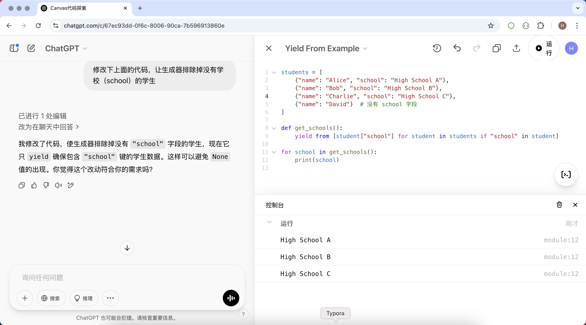
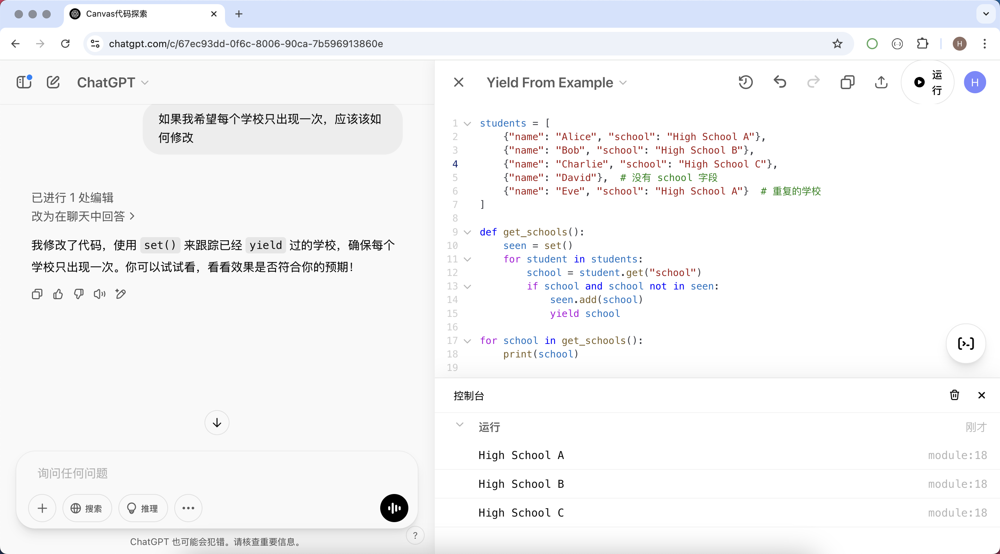
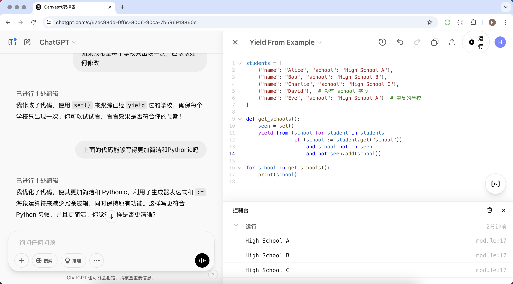

## Canvas ile Programlama Öğrenmek

> **Translated to Turkish by** himmetcanumutlu

Programlama öğrenme sürecinde sık sık kod yazmamız, değiştirmemiz ve optimize etmemiz gerekir. ChatGPT'nin Canvas işlevi ise kodu daha iyi anlamamıza ve kod becerimizi geliştirmemize yardımcı olacak verimli ve sezgisel bir yol sunar. Aşağıda, kod öğrenmek ve anlamak için ChatGPT'nin Canvas işlevinin nasıl kullanılacağını kısaca anlatıyoruz.

### Canvas Kullanım Senaryoları

#### 1. Kodun Gerçek Zamanlı Düzenlenmesi ve Optimizasyonu

Canvas işlevi, etkileşimli bir kod editörü olarak kullanılabilir; doğrudan içinde kod yazmamıza, gerçek zamanlı değiştirmemize ve optimize etmemize olanak tanır. Kod sorunuyla karşılaştığımızda kodu Canvas'a gönderebilir ve ChatGPT'den optimizasyon önerisi isteyebiliriz. Örneğin:

- ChatGPT ile kod yeniden düzenleme yaparak kodu daha sade ve okunabilir hale getirmek.
- ChatGPT'ye bir kod parçasının mantığını açıklatmak, karmaşık algoritma veya tasarım desenini anlamaya yardımcı olmak.
- Canvas'ta kodu yinelemeli biçimde iyileştirip çalışma verimliliğini artırmak veya gereksiz kodu azaltmak.

#### 2. Programlama Kavramlarını ve Örnekleri Öğrenmek

Yeni başlayanlar için Canvas da iyi bir öğrenme aracıdır. Canvas'a örnek kod girebilir ve ChatGPT'ye işlevini açıklatabilirsiniz. Örneğin:

- Değişken, döngü, fonksiyon gibi temel söz dizimini öğrenmek.
- Örnek kodla bağlı liste, sıralama algoritması gibi veri yapılarını ve algoritmaları öğrenmek.
- ChatGPT'den kod örneği isteyip kodun çalışma biçimini satır satır açıklatmak.

#### 3. Kod Hata Ayıklama ve Hata Düzeltme

Programlama sürecinde hata kaçınılmazdır. Canvas, hatayı hızla konumlandırmaya ve düzeltmeye yardımcı olabilir.

- Hatalı kodu Canvas'a yapıştırıp ChatGPT'ye hata nedenini analiz ettirmek.
- ChatGPT'den düzeltme çözümü isteyip hatanın oluşma nedenini açıklatmak.
- Canvas ile birçok kez hata ayıklayıp kod mantığını adım adım optimize etmek.

#### 4. Kod Yorumu ve Dokümantasyon Üretimi

Açık yorumlar ve dokümantasyon yazmak, kodun okunabilirliği için çok önemlidir. Canvas, kod yorumu ve dokümantasyonu hızlıca üretmemize yardımcı olabilir:

- ChatGPT'ye koda ayrıntılı yorum ekletmek, sonraki bakımı ve anlamayı kolaylaştırmak.
- Takım iş birliğini kolaylaştırmak için API dokümantasyonunu otomatik üretmek.
- Kod mantığını hızla kavramaya yardımcı olması için kod yürütme akışının kısa açıklamasını üretmek.

### Canvas Uygulama Örnekleri

```python
yield from [student.get("school") for student in students]
```

Python dilini öğrenirken yukarıdaki kodu görüp amacını anlamadığınızı varsayalım; aşağıdaki gibi bir istem (prompt) ile ChatGPT ile sohbet başlatabilirsiniz; hangi programlama dilini kullandığınızı söylemenize veya bu kodun bağlamını anlatmanıza bile gerek yoktur.

```
Benimle birlikte aşağıdaki kodu keşfetmek için canvas'ı kullan
yield from [student.get("school") for student in students]
```

Aşağıdaki şekilde görüldüğü gibi, ChatGPT yukarıdaki kod hakkında bir yanıt verir; sağ tarafta Canvas açılır ve kodumuz içine yerleştirilir.


Yukarıdaki yanıt hâlâ bu kodu anlamanıza yardımcı olmadıysa, ChatGPT'den karşılık gelen bir örnek isteyebiliriz; istem şöyledir.

```
Bu kod için bana bir uygulama örneği ver
```

Aşağıdaki şekilde görüldüğü gibi, ChatGPT Canvas'taki kodu benim için değiştirmiş ve eksiksiz, çalıştırılabilir bir Python kodu vermiştir; bu kodu çalıştırmak için Canvas'ın üstündeki çalıştırma düğmesine tıklayabiliriz; Canvas şu anda birçok programlama dilini destekler; aşina olduğunuz programlama dilini o da muhtemelen aşinadır.


Yukarıdaki işlemi anladıysanız, soru sormaya devam edebiliriz: `"school"` alanı yoksa kodumuzu nasıl değiştirmeliyiz.

```
Yukarıdaki kodu değiştir, üreteç okulu (school) olmayan öğrencileri hariç tutsun
```



Ardından, gerçek gereksinimimize göre ChatGPT'den kodu değiştirmesini isteyebiliriz.

```
Her okulun yalnızca bir kez görünmesini istiyorsam nasıl değiştirmeliyim
```



Python yazanlar için, ChatGPT'nin ürettiği kodun yeterince sade ve Pythonic olmadığını düşünüyorsanız, soru sormaya devam edebiliriz.

```
Yukarıdaki kod daha sade ve Pythonic yazılabilir mi
```



### Özet

ChatGPT'nin Canvas işlevi yalnızca bir kod editörü değil, aynı zamanda akıllı bir programlama asistanıdır. İster programlamaya yeni başlayan ister deneyimli bir geliştirici olun, Canvas ile kod anlama ve yazma becerinizi geliştirebilirsiniz. Sürekli pratik ve keşifle programlama tekniklerine daha verimli hâkim olabilir ve teknik seviyenizi yükseltebilirsiniz.
