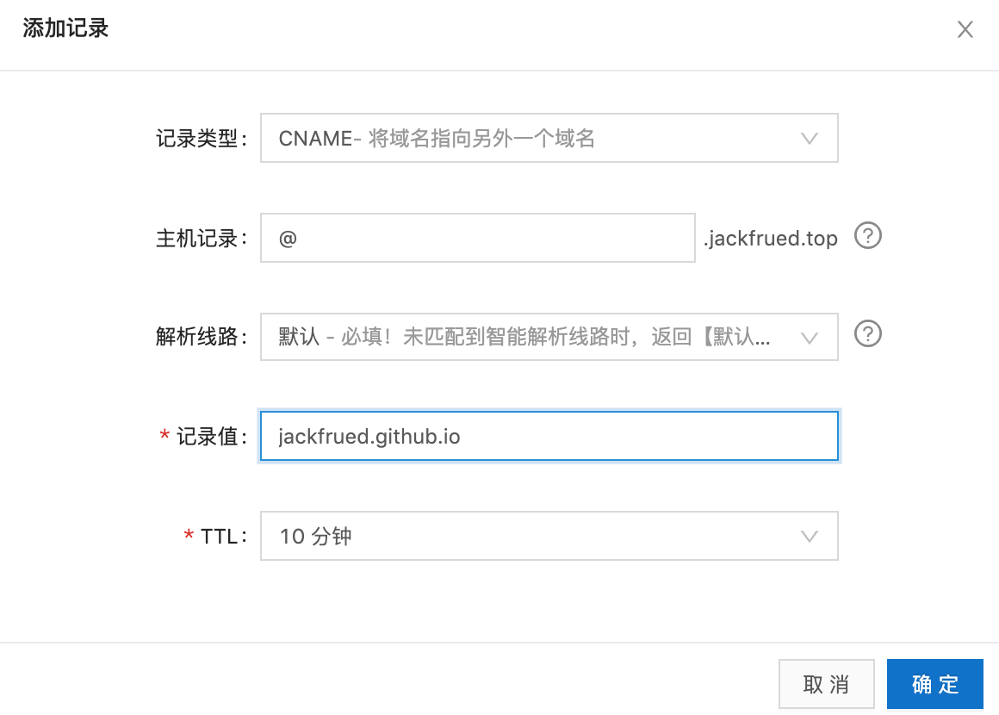

## Hexo ile Kendi Blogunuzu Kurmak

> **Translated to Turkish by** himmetcanumutlu

Bir programcı için kendine ait bir blog platformu kurmak çok anlamlı bir iştir. Öncelikle blog, kendi gelişim sürecinizi kaydedebilir; aynı zamanda bir dönemlik öğrenme ve çalışmanızın özeti ve birikimidir; ayrıca blog ile kendinizi pazarlayabilir, internet veya sektördeki etkinizi artırabilir, gelecekte daha iyi bir kariyer için sağlam bir temel atabilirsiniz. Birkaç yıl önce 《Yumuşak Beceriler - Kod Dışı Hayatta Kalma Rehberi》 adlı çok satan bir kitap vardı; kitapta şöyle bir paragraf olduğunu hatırlıyorum: "Popüler müzik gruplarının müzik yeteneği, gece kulübünde sahne alan gruplardan çok daha yüksek olmayabilir; onlar neden dünya çapında turneye çıkıp birbiri ardına platin plaklar çıkarabilir? ... Pazarlamanızı ne kadar iyi yaparsanız, yeteneğiniz de o kadar eksiksiz sergilenir."

Burada lafı uzatmadan iki cümle söyleyeyim: İnternetin bu kadar geliştiği günümüzde kendimizi nasıl pazarlamalıyız? Kişisel pazarlama önce kişisel marka oluşturmaktan başlar; bir programcı için yapılması en kolay iş yine kendi blogunu kurmaktır. Blog, internetteki üssünüz gibidir; özellikle kendinize ait bağımsız bir bloga sahip olduğunuzda, kendi düşüncelerinizi aktarmaktan etkinizi artırmaya kadar yapmak istediğiniz pek çok şeyi yapabilirsiniz; elbette blogunuzu çok iyi yönetirseniz bundan kazanç da elde edebilirsiniz. Elbette blog dışında canlı yayın, video sitesi, yazı gönderme, kitap yazma, teknik etkinlik de seçilebilir kişisel pazarlama yöntemleridir. Elbette kişisel pazarlama da süreklilik gerektirir; üç gün çalışıp iki gün ara vermekle bir şey elde etmek zordur.

### Hexo'ya Genel Bakış

Hexo, [Markdown](<https://zh.wikipedia.org/zh-hans/Markdown>) dokümanlarını güzel web sayfalarına dönüştürebilen hızlı, sade ve verimli bir blog çerçevesidir; böylece çok kısa sürede sitenin statik içeriğini hızla oluşturabiliriz; Markdown biçimi de programcılar için muhtemelen yabancı değildir. Hexo ile kendi blogunuzu kurmak için [resmî dokümandan](<https://hexo.io/zh-cn/>) daha iyi bir eğitim düşünemiyorum; Hexo'yu anlamak için resmî dokümanı okumanızı şiddetle öneririm; aşağıda yalnızca kısa bir kullanım açıklaması yapıyorum.

> Açıklama: **Markdown**, hafif bir işaretleme dilidir; insanların okuması ve yazması kolay düz metin biçiminde doküman yazmasına olanak tanır; ayrıca görsel, grafik ve matematik formüllerini destekler; e-kitap, yazılım dokümantasyonu yazmak için kullanılabilir; aynı zamanda HTML sayfasına veya PDF dokümanına çok kolay dönüştürülebilir.

Hexo'yu kullanmak için önce bilgisayarda [node.js](<https://nodejs.org/en/>) ortamının ve [git](<https://git-scm.com/>) ortamının kurulu olduğundan emin olmanız gerekir; birincisi sunucu tarafında JavaScript kodu çalıştırabilen bir ortamdır, ikincisi ise sürüm kontrol aracıdır. node.js kurmak esas olarak onun paket yönetim aracı npm'i kullanmak içindir; bu nedenle önce sistematik olarak node.js öğrenmeniz gerekmez; git kurmak ise sürüm kontrol sistemiyle kod klonlamak ve blog projesini üçüncü taraf platforma barındırmak içindir; git öğrenmek isterseniz en iyi kaynak, resmî sitedeki [*Git Pro*](<https://git-scm.com/book/zh/v2>) ve [《Git Yetkili Rehberi》](<http://www.worldhello.net/gotgit/index.html>)dir. Kurulum tamamlandıktan sonra node.js ortamının ve paket yönetim aracının başarıyla kurulup kurulmadığını aşağıdaki komutla doğrulayabiliriz.

```Shell
node --version
npm --version
```

git ortamının kurulu olup olmadığını aşağıdaki komutla kontrol edebilirsiniz.

```Shell
git --version
```

Hexo'yu kurmak için npm'i kullanabiliriz; npm, node.js'in paket yönetim aracıdır; Python'un pip aracıyla aynı işi görür; bağımlılık kütüphanelerini ve üçüncü taraf araçları kurmak için kullanılabilir. npm'i ilk kez kullandığınızda, npm'in indirme deposunu önce yurt içi Taobao aynasına çevirebiliriz; böylece indirme hızı belirgin biçimde artar.

```Shell
npm config set registry https://registry.npm.taobao.org
```

Ardından npm ile Hexo'yu kuruyoruz; komut şöyledir.

```Shell
npm install -g hexo-cli
```

Kurulum başarılı olduktan sonra Hexo ile kendinize ait bir blog oluşturabilirsiniz.

### Blog Kurulumu

> Açıklama: Aşağıdaki içerik temelde Hexo resmî dokümanından gelmektedir; resmî dokümanı okumanız önerilir.

Önce blog projesini saklamak için özel bir klasör oluşturmak üzere aşağıdaki komutu kullanalım; bu komut github'dan blog projesini ve varsayılan temayı klonlar.

```Shell
hexo init blog
```

Ardından bu klasöre girip dizin yapısına bakalım.

```Shell
cd blog
ls -lR
```

```
total 232
-rw-r--r--    1 Hao  staff    1768  8  8 01:15 _config.yml
drwxr-xr-x  274 Hao  staff    8768  8  8 01:19 node_modules
-rw-r--r--    1 Hao  staff  109972  8  8 01:19 package-lock.json
-rw-r--r--    1 Hao  staff     443  8  8 01:15 package.json
drwxr-xr-x    5 Hao  staff     160  8  8 01:15 scaffolds
drwxr-xr-x    3 Hao  staff      96  8  8 01:15 source
drwxr-xr-x    3 Hao  staff      96  8  8 01:15 themes
```

> Açıklama: Windows ortamında komut satırı isteminde dizin yapısını görüntülemek için `dir` komutu kullanılabilir. Belirtmek gerekir: `_config.yml` blog projesinin yapılandırma dosyasıdır; `package.json` projenin bağımlılık dosyasıdır; `scaffolds`, Markdown dosyalarının şablonlarını, yani yeni eklenen Markdown dosyalarına varsayılan olarak doldurulan içeriği saklar; `source` dizininde `_post` adlı bir dizin vardır, yazdığımız Markdown dosyalarını bu dizine koyabiliriz; böylece Hexo Markdown dosyalarını blogun statik sayfalarına dönüştürür, üretilen statik sayfalar `public` dizinine konur; `themes` klasörü blogun kullandığı temayı saklar.

Ardından projenin gereksinim duyduğu bağımlılıkları kurmak için aşağıdaki komutu kullanalım (`package.json` dosyası bu bağımlılıkları belirtir).

```Shell
npm install
```

Yukarıdaki işlemleri yaptıktan sonra, aşağıdaki komutla blogu doğrudan üretebiliriz.

```Shell
hexo generate
```

Bu komut şöyle de kısaltılabilir:

```Shell
hexo g
```

Bağımlılıkları kurarken `hexo-server` adlı bir bağımlılık da kurmuştuk; bu bağımlılık, blog projemizi çalıştırmak için node.js tabanlı bir sunucu başlatmamıza yardımcı olur; sunucuyu başlatmak için aşağıdaki komut kullanılabilir.

```Shell
hexo server
```

Bu komut da şöyle kısaltılabilir:

```Shell
hexo s
```

```
INFO  Start processing
INFO  Hexo is running at http://localhost:4000 . Press Ctrl+C to stop.
```

Komutu çalıştırmanın ipucu bilgisinden görüldüğü gibi, sunucu çalışmaya başlamış ve 4000 portunu kullanmıştır; sunucuyu durdurmak için `Ctrl+C` kullanılabilir. Sunucunun kullandığı portu değiştirmek isterseniz, sunucuyu başlatırken `-p` parametresini ekleyebilirsiniz; sunucu başladıktan sonra varsayılan tarayıcının sunucuya otomatik açılmasını isterseniz `-o` parametresini kullanabilirsiniz; aşağıdaki gibidir.

```Shell
hexo s -p 8000 -o
```

Bu noktada, Hexo'nun yapılandırma yapılmadan ve kendi Markdown dosyamız eklenmeden ürettiği ana sayfayı görebiliriz; aşağıdaki şekilde gösterilmiştir.


Ardından blogun yapılandırma dosyasını değiştiriyoruz.

```Shell
vim _config.yml
```

```YAML
# Hexo Configuration
## Docs: https://hexo.io/docs/configuration.html
## Source: https://github.com/hexojs/hexo/

# Site
title: 骆昊'nun Teknik Köşesi
subtitle: Bilgiyi aktarmak, öğretmek, aydınlatmak; bilginin getirdiği mutluluğu paylaşmak
description:
keywords:
author: 骆昊
language: zh
timezone:

# URL
## If your site is put in a subdirectory, set url as 'http://yoursite.com/child' and root as '/child/'
url: http://jackfrued.top
root: /
permalink: :year/:month/:day/:title/
permalink_defaults:

# Directory
source_dir: source
public_dir: public
tag_dir: tags
archive_dir: archives
category_dir: categories
code_dir: downloads/code
i18n_dir: :lang
skip_render:

# Writing
new_post_name: :title.md # File name of new posts
default_layout: post
titlecase: false # Transform title into titlecase
external_link: true # Open external links in new tab
filename_case: 0
render_drafts: false
post_asset_folder: false
relative_link: false
future: true
highlight:
  enable: true
  line_number: true
  auto_detect: false
  tab_replace:
  
# Home page setting
# path: Root path for your blogs index page. (default = '')
# per_page: Posts displayed per page. (0 = disable pagination)
# order_by: Posts order. (Order by date descending by default)
index_generator:
  path: ''
  per_page: 10
  order_by: -date
  
# Category & Tag
default_category: uncategorized
category_map:
tag_map:

# Date / Time format
## Hexo uses Moment.js to parse and display date
## You can customize the date format as defined in
## http://momentjs.com/docs/#/displaying/format/
date_format: YYYY-MM-DD
time_format: HH:mm:ss

# Pagination
## Set per_page to 0 to disable pagination
per_page: 10
pagination_dir: page

# Extensions
## Plugins: https://hexo.io/plugins/
## Themes: https://hexo.io/themes/
theme: landscape

# Deployment
## Docs: https://hexo.io/docs/deployment.html
deploy:
  type:
```

Aşağıda YAML dosyasındaki ilgili seçeneklerin açıklaması verilmiştir.

| Parametre          | Açıklama                                                         |
| ------------------ | ------------------------------------------------------------ |
| `title`            | Sitenin başlığı                                                   |
| `subtitle`         | Sitenin alt başlığı                                                 |
| `description`      | Sitenin açıklaması                                                   |
| `keywords`         | Sitenin anahtar kelimeleri, birden çok anahtar kelime virgülle ayrılabilir |
| `author`           | Kendi adınız                                                   |
| `language`         | Sitenin kullandığı dil                                               |
| `timezone`         | Sitenin kullandığı saat dilimi, varsayılan olarak bilgisayardaki saat dilimi kullanılır |
| `url`              | Web adresi                                                         |
| `root`             | Sitenin kök dizini                                                   |
| `source_dir`       | Kaynak klasörü, bu klasör içerik saklamak için kullanılır, varsayılan source dizini |
| `public_dir`       | Ortak klasör, bu klasör üretilen site dosyalarını saklamak için kullanılır, varsayılan public dizini |
| `tag_dir`          | Etiket klasörü, varsayılan tags dizini                              |
| `archive_dir`      | Arşiv klasörü, varsayılan archives dizini                               |
| `category_dir`     | Kategori klasörü, varsayılan categories dizini                             |
| `auto_spacing`     | Çince ve İngilizce arasına boşluk ekle, varsayılan false                         |
| `titlecase`        | Başlığı ilk harfi büyüğe çevir, varsayılan false                           |
| `external_link`    | Bağlantıyı yeni sekmede aç, varsayılan true                                |
| `relative_link`    | Bağlantıyı kök dizine göreli konuma çevir, varsayılan false                     |
| `default_category` | Varsayılan kategori                                                     |
| `date_format`      | Tarih biçimi, varsayılan YYYY-MM-DD                                    |
| `time_format`      | Saat biçimi, varsayılan HH:mm:ss                                      |
| `per_page`         | Sayfa başına gösterilen yazı sayısı, varsayılan 10, 0 sayfalamayı kapatır |
| `pagination_dir`   | Sayfalama dizini, varsayılan page dizini                                   |
| `theme`            | Mevcut tema adı                                                 |
| `deploy`           | Dağıtım bölümünün ayarı                                               |

Yazdığımız Markdown dosyalarını `source/_posts` dizinine kopyalayabiliriz; her Markdown dosyasının en üstüne Front-matter ekleyerek dosyanın yerleşimi, başlığı, kategorisi, etiketi, yayın tarihi gibi bilgileri açıklayabiliriz. Front-matter, her Markdown dosyasının en üstünde `---` ile ayrılan bölgedir; Front-matter içinde aşağıdaki içerikler ayarlanabilir.

| Parametre    | Açıklama                 | Varsayılan değer       |
| ------------ | -------------------- | ------------ |
| `layout`     | Yerleşim                 |              |
| `title`      | Başlık                 |              |
| `date`       | Oluşturma tarihi            | dosyanın oluşturulma tarihi |
| `updated`    | Güncelleme tarihi            | dosyanın güncelleme tarihi |
| `comments`   | Yazının yorum işlevini aç   | true         |
| `tags`       | Etiket (sayfalama için uygun değildir) |              |
| `categories` | Kategori (sayfalama için uygun değildir) |              |
| `permalink`  | Yazı URL'sini geçersiz kıl   |              |

Örneğin:

```Markdown
---
title: Python Programlama İdiomları
categories: 
- Python Temelleri
tags:
- Python
- PEP8
date: 2019-8-1
---
## Python İdiomları

“İdiom” sözcüğü “alışılmış yapılış biçimi, olağan yöntem, değişmeyen uygulama” anlamına gelir; bu sözcüğün karşılık geldiği İngilizce kelime "idiom"dur. Python'un diğer birçok programlama dilinden söz dizimi ve kullanım açısından belirgin farkları olduğundan, bir Python geliştiricisi olarak bu idiomlara hâkim olmazsanız "Pythonic" kod yazamazsınız. Aşağıda Python geliştirmede yaygın kullanılan bazı kodları özetledik.

1. Kodun hem içe aktarılabilir hem çalıştırılabilir olmasını sağlayın.
   if __name__ == '__main__':

2. Mantıksal "doğru" veya "yanlış"ı aşağıdaki biçimde değerlendirin.
   if x:
   if not x:
```


Yukarıdaki işleri tamamladıktan sonra, önce üretilen içeriği temizlemek için aşağıdaki komutu kullanabiliriz.

```Shell
hexo clean
```

Ardından daha önce anlattığımız komutlarla blog projesini yeniden üretip çalıştırabiliriz.

```Shell
hexo generate
hexo server -p 8000 -o
```

### Blogu GitHub'a Barındırmak

Blogumuzu barındırmak için GitHub sitesinin sağladığı [Pages](<https://pages.github.com/>) hizmetini kullanabiliriz. GitHub Pages'in ana sayfasında, kendi sitemizi nasıl barındıracağımızı gösteren bir eğitim vardır; elbette ilk adım GitHub'da kendinize ait bir hesap oluşturmaktır; giriş başarılı olduktan sonra sonraki işlemlere geçilebilir.

1. Kullanıcı adınıza göre bir depo oluşturun; deponun adı **kesinlikle** "kullanıcıadı.github.io" olmalıdır. Örneğin: GitHub'daki kullanıcı adım jackfrued ise, blog projemi barındıran deponun adı kesinlikle jackfrued.github.io olmalıdır.

   

2. Blog projesinin `_config.yml` yapılandırma dosyasını değiştirin; blog projesini dağıtmak için GitHub kullanılacak şekilde yapılandırın.

   ```Shell
   vim _config.yml
   ```

   ```YAML
   # Yukarıdaki içerik atlandı
   # Deployment
   ## Docs: https://hexo.io/docs/deployment.html
   deploy:
     type: git
     repo: https://github.com/jackfrued/jackfrued.github.io.git
     branch: master
   ```

   Yukarıdaki yapılandırmada type, proje dağıtımı için git kullanılacağını belirtir; repo, projeyi dağıtan git deposunun URL'sini belirtir; burada HTTPS adresini kullandık; daha önce anahtar çifti yapılandırdıysanız SSH adresi de kullanılabilir; branch, kodun depodaki hangi dala eşitleneceğini belirtir; genellikle master dalı, projenin nihai iş sonuçlarını yayınlayan daldır; projenin ana dalı olarak da adlandırılır.

3. `hexo-deployer-git` adlı dağıtıcı eklentisini kurun; bu eklentiyle tek tıkla dağıtım yapılabilir.

   ```Shell
   npm install hexo-deployer-git --save
   ```

4. Tek tıkla GitHub'a dağıtmak için aşağıdaki komut kullanılabilir.

   ```Shell
   hexo deploy -g
   ```

   veya

   ```Shell
   hexo generate -d
   ```

5. Ardından tarayıcıya [jackfrued.github.io](https://jackfrued.github.io) yazarak kendi blogunuzu görebilirsiniz; artık dünyadaki herkes bu URL üzerinden blogunuza erişebilir. Fark ettiniz mi, blogunuza erişen bu URL tam da az önce depoya verdiğimiz addır; çünkü GitHub'da kaydolduğunuz kullanıcı adı benzersizdir; bu nedenle bu alan adı da dünyada benzersizdir.

### Blogu Kendi Alan Adınıza Bağlamak

GitHub'ın sağladığı alan adıyla blogumuza erişebilsek de "başkasının kanadı altında yaşamak" istemiyorsak, GitHub Pages'in sağladığı barındırma hizmetini kullanırken blogu kendimize özel alan adına da bağlayabiliriz. Henüz alan adı satın almadıysak, alan adı satın alma hizmeti sunan sitelerden (örneğin [Wanwang](<https://www.hichina.com/>), [GoDaddy](<https://www.godaddy.com/>)) satın alabiliriz.


> **Açıklama**: Günümüzde yurt içinde alan adı yönetimi giderek sıkılaşıyor; alan adı satın alırken bir yığın kişisel bilgi doldurmak ve gerçek ad doğrulamasından sonra alan adını almak gerekir; bu noktayı herkesin anlayacağına inanıyorum.

Örneğin, şimdi "jackfrued.top" adlı bir alan adı satın aldım; onu "jackfrued.github.io" alan adına nasıl bağlarız? [Aliyun konsolunu](<https://dns.console.aliyun.com/>) veya [DNSPod](<https://www.dnspod.cn/>) kullanarak alan adı çözümleme hizmeti yapabiliriz. Alan adı çözümleme platformuna başarıyla giriş yaptıktan sonra, alan adınızı ekleyip veya seçip alan adı çözümlemeyi yapılandırabilirsiniz. "Kayıt Ekle" düğmesine tıklayıp CNAME türünde bir alan adı çözümlemesi oluşturun; CNAME türündeki çözümleme, bir alan adını başka bir alan adına çözümlemeyi temsil eder; aşağıdaki şekilde gösterilmiştir.



Bu adımı tamamladıktan sonra, kendi alan adınızla blog projesine henüz hemen erişemezsiniz; son olarak blog projesinin `source` dizinine CNAME adlı bir dosya eklemeniz gerekir (lütfen bu dosyanın adının tamamen büyük harflerle olduğuna dikkat edin); dosyanın içeriği şöyledir.

```
jackfrued.top
```

Önceden üretilen içeriği temizleyip projeyi yeniden üretip GitHub'a yayınlayabilirsiniz; işlem tamamdır! Artık bağımsız alan adlı bir blogumuz var; umarım onu anlamlı işler yapmak için kullanırsınız (kendi gelişim sürecinizi kaydetmek, iş deneyiminizi paylaşmak, kişisel etkinizi artırmak).

Haydi programcılar!
