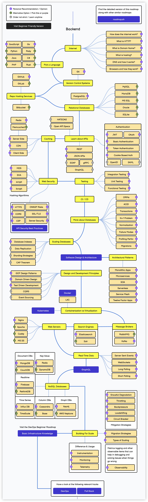
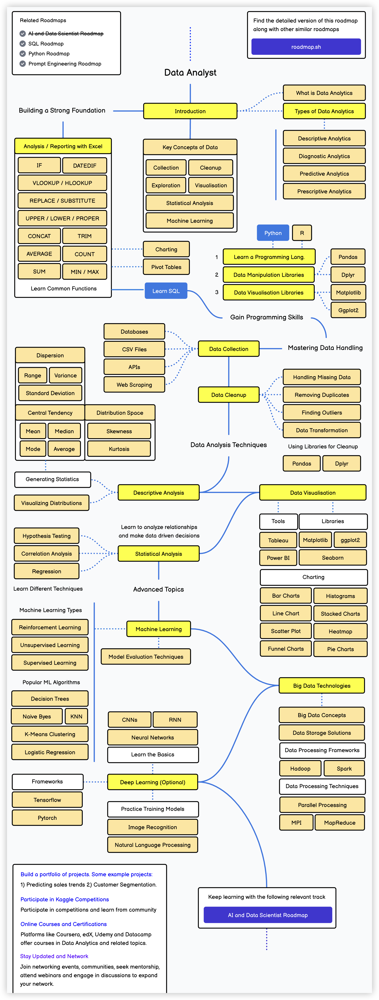

## Birkaç Öğrenme Yol Haritası Paylaşmak

> **Translated to Turkish by** himmetcanumutlu

Bugün [Developer Roadmaps](https://roadmap.sh) adlı bir siteye göz attım; orada pek çok öğrenme yol haritası var. Bunlardan Python hakkındaki bir öğrenme yol haritası oldukça iyi; sizlerle paylaşıyorum. Python'u mühendislik geliştirme (arka uç geliştirme, arayüz geliştirme, uygulama geliştirme vb.) için kullanacaksanız, bu şekildeki içeriklerin temelde hepsiyle ilgilenmeniz gerekir; Python'u yalnızca yardımcı bir araç olarak kullanacaksanız, daha önce sizler için derlediğim [《Sıfırdan Python Öğrenin》](https://www.zhihu.com/column/c_1216656665569013760) adlı 20 ders yeterli olacaktır. Son zamanlarda bu 20 dersin içeriğini de yeniden düzenliyorum; yeniden düzenlenen içerik "2025 Sürümü" olarak işaretlenecek ve bu süreçte sizlerin görüş ve önerilerini de duymak istiyorum.

Burada üç ilgili öğrenme yol haritası daha var; sırasıyla arka uç geliştirme (Backend), geliştirme işletmesi (DevOps) ve veri bilimi (Data Science). Arka uç geliştirme öğrenme yol haritası aşağıdaki gibidir; içeriği görece kapsamlıdır, çekirdek programlama dili Java veya Go'dur. Ben kişisel olarak Python'u arka uç geliştirme için kullanmanızı önermiyorum; Python diline zaten iyi hâkimseniz ve aynı zamanda yeterli bilgisayar bilimi bilgisine sahipseniz, AI uygulama geliştirme alanını deneyebilirsiniz; daha fazla kazanım elde edeceğinize inanıyorum. Mor renkle işaretlenen maddelere dikkat edebilirsiniz; bunlar yazarın önerdiği seçeneklerdir ve büyük bölümü benim de arka uç geliştiricilere önermek istediğim içeriklerdir.

Geliştirme işletmesi öğrenme yol haritasına da bakalım; şu anda DevOps de işe alım piyasasının popüler pozisyonlarından; ilgilenenler takip edebilir.

Biraz Python bilgisi öğrendiyseniz ve bunu temel alarak veri analizine geçmek istiyorsanız, aşağıdaki öğrenme yol haritasına bakabilirsiniz. Belirtmek gerekir ki Python yalnızca veri analizi yapmak için bir araçtır; mükemmel bir veri analisti olmak için iyi bir veri düşüncesine sahip olmak ve aynı zamanda yeterli iş bilgisi biriktirmek gerekir; ancak böylece veriden ticari içgörü üretilir, veriyle ürün optimize edilir, iş yönlendirilir ve kararlara gerçekten güçlü destek sağlanır.

Son olarak herkese yeniden hatırlatayım: öğrenmeye başlamak istiyorsanız [yorum alanına](https://zhuanlan.zhihu.com/p/23821670129) mesaj bırakmayı unutmayın! **Veri bilimine** (veri analizi, veri madenciliği, veri yönetimi vb.) girmek istiyorsanız da bana mesaj bırakabilirsiniz; bu yıl ilgili içerikleri sürekli üretmeye devam etmeliyim.

