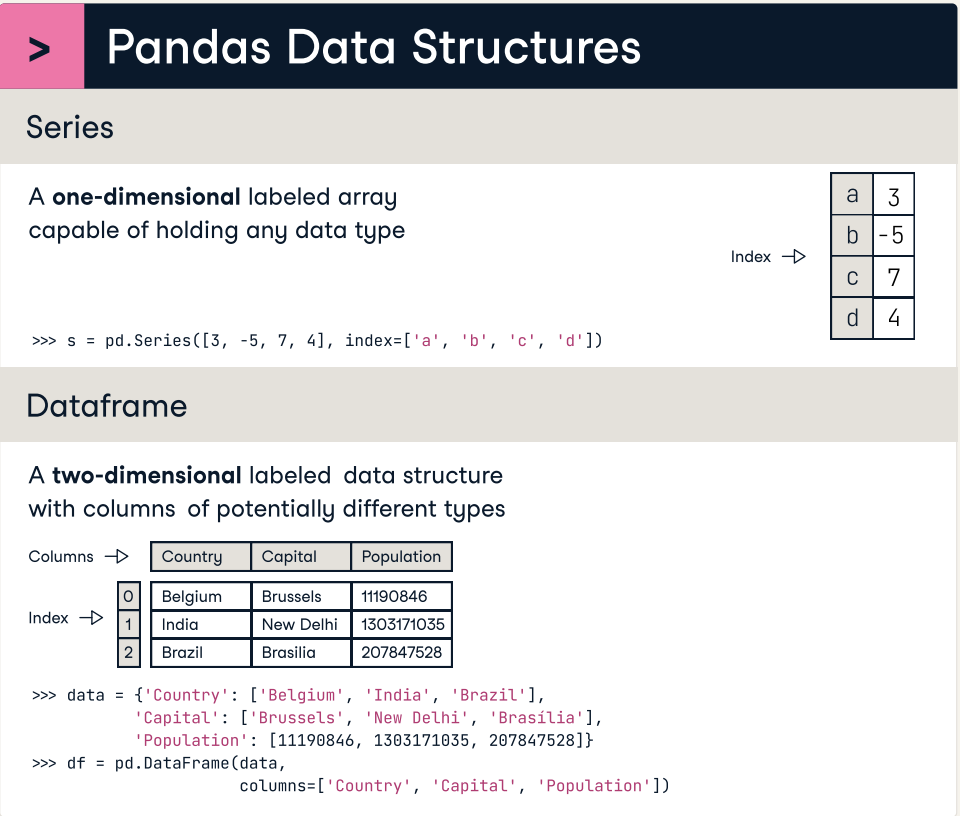

## pandas Kütüphanesine Hızlıca Nasıl Hâkim Olunur

> **Translated to Turkish by** himmetcanumutlu

Son zamanlarda bir arkadaş, Python ile veri analizi yaparken pandas kütüphanesinin fonksiyon ve yöntemlerinin gerçekten çok fazla olduğunu, öğrenirken ve kullanırken düşüncenin çok karıştığını belirtti. Bu soruyu daha önce yanıtlamıştım; bugün daha sistematik biçimde düzenliyorum; çünkü bu kütüphane, Python veri bilimi ekosisteminde son derece önemli bir rol oynar; şu anda pandas'ın pek çok alternatifi olsa da (polars, cuDF gibi), kullanım biçiminin pandas ile büyük ölçüde aynı olduğu söylenebilir.

### Üç Çekirdek Sınıf

Pandas kütüphanesinin üç çekirdek sınıfı vardır; bunlardan en önemlisi `DataFrame` türüdür, öğrenmenin odak noktasıdır; aşağıdaki şekilde gösterilmiştir.



1. `Series`: Tek boyutlu veriyi temsil eder; tek boyutlu diziye benzer (etiketli dizi); her verinin kendi indeksi (etiketi) vardır; veriye indeks üzerinden erişilebilir.
2. `DataFrame`: İki boyutlu veriyi temsil eder; Excel elektronik tablosuna benzer; satır ve sütunların kendi indeksi (etiketi) vardır; satıra, sütuna ve hücreye indeks üzerinden erişilebilir.
3. `Index`: İndeksi temsil eder; `Series` ve `DataFrame`'e indeks hizmeti sağlar; `Index`'in birçok alt türü vardır; farklı türde indeks gerektiren senaryolar için uygundur.

### Veri Analizi Akışı

pandas'ı öğrenirken ve kullanırken odak noktası `DataFrame` uygulamasıdır; karşılık gelen fonksiyon ve yöntemlere veri analizi akışına göre hâkim olmanızı öneririz; böyle yapmak genellikle yarı çabayla iki kat sonuç verir. Veri analizi akışı aşağıdaki şekilde gösterilmiştir; mavi kesikli çemberin içindeki kısım, BI araçları (Power BI, Tableau gibi) veya Python programıyla tamamlanabilen kısımdır.


#### Veri Alma

Veri alma, veri yükleme olarak da adlandırılabilir; özü `DataFrame` nesnesi oluşturmaktır; şu fonksiyonlara hâkim olmak gerekir:

1. CSV dosyasından veri yükleme.

```python
pd.read_csv(
    filepath,      # CSV dosyasının yolu (yerel mutlak veya göreli yol olabilir, URL de olabilir)
    sep,           # alan ayracı (varsayılan virgüldür)
    header,        # tablo başlığının kaçıncı satırda olduğu
    encoding,      # dosya kodlaması (varsayılan utf-8)
    quotechar,     # string'i saran sembol (varsayılan çift tırnaktır)
    usecols,       # hangi sütunların yükleneceği
    index_col,     # indeks sütununu belirt
    dtype,         # sütunların veri türünü belirt
    converters,    # sütunların veri dönüştürücüsünü belirt
    nrows,         # kaç satır veri yükleneceği
    skiprows,      # atlanması gereken satırları belirt
    parse_dates,   # hangi sütunların tarih-saat olarak ayrıştırılacağı
    date_format,   # tarih biçimi
    true_values,   # True Boolean değeri olarak kabul edilen değerler
    false_values,  # False Boolean değeri olarak kabul edilen değerler
    na_values,     # boş değer olarak kabul edilen değerler
    na_filter,     # boş değer işaretinin algılanıp algılanmayacağı
    on_bad_lines,  # sorunlu satırla karşılaşınca nasıl davranılacağı (seçenekler: 'error', 'warn', 'skip')
    engine,        # alt katman motorunu belirt (örneğin daha büyük veriyi işlemek için daha hızlı Arrow motoru kullanılabilir)
    iterator,      # yineleyici modunun açılıp açılmayacağı (büyük veri işlerken bellek kullanımını azaltır)
    chunksize,     # yineleyici modunda her yüklemenin boyutu
)
```

2. Excel dosyasından veri yükleme.

```python
pd.read_excel(
    io,           # çalışma kitabı dosyasının yolu
    sheet_name,   # çalışma sayfasının adı
    skip_footer,  # sondan kaç satır atlanacağı
)
```

> **Açıklama**: `read_excel` fonksiyonunun `read_csv` ile aynı işlevi gören birçok parametresi vardır; burada ayrıntıya girmiyoruz. Excel dosyasından veri yüklerken yineleyici modu yoktur.

3. Veritabanından veya veri ambarından veri yükleme.

```python
pd.read_sql(
    sql,          # SQL sorgusu veya iki boyutlu tablonun adı
    con,          # veritabanı bağlantısı
    parse_dates,  # tarih olarak ayrıştırılması gereken sütunları belirt
    index_col,    # indeks sütununu belirt
    columns,      # yüklenecek sütunlar
    chunksize,    # veri yükleme boyutu
    dtype,        # sütunların veri türünü belirt
)
```

4. `DataFrame` nesnesi oluşturmanın diğer yolları.

```python
pd.DataFrame(data=[[95, 87], [66, 78], [92, 89]], index=[1001, 1002, 1003], columns=['Verbal', 'Math'])
pd.DataFrame(data={'Verbal': [95, 66, 92], 'Math': [87, 78, 89]}, index=[1001, 1002, 1003])
```

`DataFrame` içindeki veriye veya indekse işlem yapmak için aşağıdaki işlem ve yöntemlere hâkim olmak gerekir.

1. Bilgileri görüntüleme

```python
df.info()
```

2. İlk/son N satırı görüntüleme

```python
df.head(10)
df.tail(5)
```

3. Sütuna işlem yapma

```python
df['column_name']
df.column_name
```

4. Satıra işlem yapma

```python
df.loc['row_index']
df.iloc[0]
```

5. Hücreye işlem yapma

```python
df.at['row_index', 'column_name']
df.iat[0, 0]
```

6. Satır veya sütun silme

```python
df.drop(
    labels,   # silinecek satır veya sütunun indeksi
    axis,     # axis=0 ise labels satır indeksini, axis=1 ise sütun indeksini gösterir
    index,    # silinecek satırların indeksi
    columns,  # silinecek sütunların indeksi
    inplace,  # yerinde silinip silinmeyeceği (inplace=True yerinde silmeyi, yeni DataFrame nesnesi döndürülmemesini gösterir)
)
```

7. Veriyi filtreleme

```python
df.query(expr)  # ifadeyle filtre koşulunu belirt
df[bool_index]  # Boolean indeks
```

8. Rastgele örnekleme

```python
df.sample(
    n,             # örneklem kapasitesi
    frac,          # örnekleme oranı
    replace,       # geri koymalı veya geri koymasız örnekleme (varsayılan False)
    random_state,  # rastgele sayı tohumu (tohum aynıysa her örneklemenin sonucu aynıdır)
)
```

9. İndeksi sıfırlama

```python
df.reset_index(
    level,    # çok seviyeli indekste hangi seviyenin sıfırlanacağını belirt
    drop,     # indeksin atılıp atılmayacağı (drop=False indeksin normal sütun olarak işleneceğini gösterir)
    inplace,  # yerinde işlenip işlenmeyeceği (yeni DataFrame nesnesi döndürülüp döndürülmeyeceği)
)
```

10. İndeks ayarlama

```python
df.set_index(
   keys,              # indeks olarak belirtilen sütunlar
   drop,              # indeks olan sütunun silinip silinmeyeceği (varsayılan True)
   append,            # belirtilen sütunun mevcut indekse eklenip eklenmeyeceği (varsayılan False)
   inplace,           # yerinde işlenip işlenmeyeceği (yeni DataFrame nesnesi döndürülüp döndürülmeyeceği)
   verify_integrity,  # indeks sütununda yinelenen değer olup olmadığının kontrolü (varsayılan False)
)
```

11. İndeks sırasını ayarlama

```python
df.reindex()
df[fancy_index]       # süslü indeks
df.loc[fancy_index]   # süslü indeks
df.iloc[fancy_index]  # süslü indeks
```

12. İndeks sıralama

```python
df.sort_index(
    axis,         # satır indeksi mi sütun indeksi mi olduğunu belirle (varsayılan 0)
    level,        # çok seviyeli indekste indeksin seviyesini belirt
    ascending,    # artan veya azalan (varsayılan True)
    inplace,      # yerinde sıralanıp sıralanmayacağı
    kind,         # sıralama algoritması (varsayılan 'quicksort')
    na_position,  # boş değerin en başa mı en sona mı konacağı (varsayılan 'last')
    key,          # indeks büyüklüğünü karşılaştıran fonksiyon (özel karşılaştırma kuralı)
)
```


#### Veriyi Yeniden Şekillendirme

1. Birleştirme (SQL'deki union işlemine benzer)

```python
pd.concat(
    objs,          # birden çok DataFrame nesnesini saklayan kapsayıcı
    axis,          # hangi eksen boyunca birleştirileceği
    ignore_index,  # orijinal indeksin yok sayılıp sayılmayacağı (varsayılan False)
)
```

2. Eşleştirme (SQL'deki join işlemine benzer)

```python
pd.merge(
    left,         # sol tablo
    right,        # sağ tablo
    how,          # tablo bağlama biçimini belirt (varsayılan 'inner' iç birleştirmeyi gösterir)
    on,           # tablo bağlama alanını belirt (sol ve sağ tablonun bağlama alanı aynı adlıysa)
    left_on,      # sol tablonun bağlama alanını belirt
    right_on,     # sağ tablonun bağlama alanını belirt
    left_index,   # sol tablonun indeksinin bağlama için kullanılıp kullanılmayacağı
    right_index,  # sağ tablonun indeksinin bağlama için kullanılıp kullanılmayacağı
    suffixes,     # aynı adlı sütunların son ekini belirt (varsayılan ('_x', '_y'))
)
```


#### Veri Temizliği

1. Eksik değer

```python
# Eksik değeri tespit etme
df.isna()
df.notna()
# Eksik değeri silme
df.dropna(
    axis,     # satır mı sütun mu silineceği (varsayılan 0)
    how,      # herhangi bir eksik değer varsa silinip silinmeyeceği (varsayılan 'any')
    subset,   # yalnızca hangi satır veya sütunlardaki boş değerlerin silineceği
    inplace,  # yerinde silinip silinmeyeceği (yeni DataFrame nesnesi döndürülüp döndürülmeyeceği)
)
# Eksik değeri doldurma
df.fillna(
    value,    # doldurulacak değer
    method,   # boş değeri doldurma yöntemi
    inplace,  # yerinde doldurulup doldurulmayacağı (yeni DataFrame nesnesi döndürülüp döndürülmeyeceği)
)
# İnterpolasyon algoritmasıyla değer bulma
df.interpolate(
    method,   # interpolasyon algoritması (varsayılan 'linear' doğrusal interpolasyonu gösterir) 
    axis,     # hangi eksen boyunca interpolasyon yapılacağı
    inplace,  # yerinde interpolasyon yapılıp yapılmayacağı (yeni DataFrame nesnesi döndürülüp döndürülmeyeceği)
)
```

2. Yinelenen değer

```python
# Yinelenen değeri tespit etme
df.duplicated(
    subset,   # yinelenmeyi belirlemek için kullanılan sütun etiketi
    keep,     # yinelenen öğenin nasıl ele alınacağı (varsayılan 'first' ilk öğenin korunacağını gösterir)
)
# Yinelenen değeri silme
df.drop_duplicates(
    subset,   # yinelenmeyi belirlemek için kullanılan sütun etiketi
    keep,     # yinelenen öğenin nasıl ele alınacağı (varsayılan 'first' ilk öğenin korunacağını gösterir)
    inplace,  # yerinde yinelenen silme yapılıp yapılmayacağı (varsayılan False)
)
# Yinelenmeyen değerleri sayma
df.nunique(axis)
```

3. Aykırı değer

Aykırı değerin işlenmesinde odak noktası tespittir; aykırı noktaları belirlemek için sayısal yargılama yöntemi, z-score yargılama yöntemi, izolasyon ormanı gibi yöntemler kullanılabilir; ardından gerçek iş anlamıyla birleştirip aykırı değer olup olmadığı belirlenir. Aykırı değerin işlenmesi genellikle değiştirme veya silmedir; silmek için daha önce bahsettiğimiz `drop` yöntemiyle satır veya sütun silinebilir.

```python
# Aykırı değeri değiştirme
df.replace(
    to_replace,  # değiştirilecek değer
    value,       # yerine konacak değer
    inplace,     # yerinde değiştirme yapılıp yapılmayacağı (yeni DataFrame nesnesi döndürülüp döndürülmeyeceği)
    regex,       # düzenli ifade değiştirmenin açılıp açılmayacağı (varsayılan False)
)
```

4. Ön işleme

Ön işleme genellikle `Series` nesnesi üzerinde veriye işlem yapar; `s` değişkeninin bir `Series` nesnesi olduğunu varsayalım; somut işlemler şunları içerir:

- Tarih-saat ön işleme

```python
s.dt.year                   # yıl
s.dt.quarter                # çeyrek
s.dt.month                  # ay
s.dt.day                    # gün
s.dt.hour                   # saat
s.dt.minute                 # dakika
s.dt.second                 # saniye
s.dt.weekday                # haftanın hangi günü
s.dt.to_period(freq)        # belirli frekansta dönüştür
s.dt.floor(freq)            # aşağı yuvarla
s.dt.ceil(freq)             # yukarı yuvarla
s.dt.round(freq)            # yuvarla
s.dt.strftime(date_format)  # biçimlendir
s.dt.tz_localize(tz)        # saat dilimini yerelleştir
s.dt.tz_convert(tz)         # saat dilimini dönüştür
```

- String ön işleme

```python
s.str.lower()       # string'i küçük harfe çevir
s.str.upper()       # string'i büyük harfe çevir
s.str.title()       # string'in ilk harfini büyüt
# string'i bölme
s.str.split(
    pat,            # bölme karakteri veya düzenli ifade
    n,              # maksimum bölme sayısı
    expand,         # bölünen içeriğin birden çok sütuna açılıp açılmayacağı (varsayılan False)
)
# string'den içerik yakalama
s.str.extract(
    pat,            # düzenli ifade
    flags,          # düzenli ifade işleme işareti
    expand,         # yakalanan içeriğin birden çok sütuna açılıp açılmayacağı (varsayılan True)
)
s.str.isalpha()     # string'in harf olup olmadığını kontrol et
s.str.isnumeric()   # string'in sayı olup olmadığını kontrol et
s.str.isalnum()     # string'in harf-sayı olup olmadığını kontrol et
s.str.isspace()     # string'in boşluk karakteri olup olmadığını kontrol et
s.str.startswith()  # string'in belirtilen içerikle başlayıp başlamadığını kontrol et 
s.str.endswith()    # string'in belirtilen içerikle bitip bitmediğini kontrol et
# string'in düzenli ifadeyle eşleşip eşleşmediğini kontrol et
s.str.match(
    pat,            # düzenli ifade
    flags,          # düzenli ifade işleme işareti
)
# string'in belirtilen içeriği içerip içermediğini kontrol et
s.str.contains(
    pat,            # string veya düzenli ifade
    flags,          # düzenli ifade işleme işareti
    regex,          # düzenli ifade kullanılıp kullanılmayacağı (varsayılan True)
)
# değiştirme
s.str.replace(
    pat,            # değiştirilecek içerik (string veya düzenli ifade)
    repl,           # yerine konacak içerik
    n,              # maksimum değiştirme sayısı (varsayılan -1 tümünü değiştirir)
    flags,          # düzenli ifade işleme işareti
    regex,          # düzenli ifade kullanılıp kullanılmayacağı (varsayılan True)
)
s.str.strip()       # string'in fazla boşluklarını kaldır
s.str.join(sep)     # içeriği belirtilen ayraçla string'e birleştir
# string birleştirme
s.str.cat(
    others,         # birleştirilecek içerik
    sep,            # ayraç
    na_rep,         # boş değerin yerine geçen sembol
)
s.str.len()         # string uzunluğunu al
# alt dizenin konumunu bulma
s.str.find(
    sub,            # alt dize
    start,          # başlangıç konumu
    end,            # bitiş konumu
)
```

- Kategori ön işleme

```python
# Kategoriyi yeniden sıralama
s.cat.reorder_categories(
    new_categories,  # yeni kategori sırası
    inplace,         # yerinde işlenip işlenmeyeceği (varsayılan False)
)
# Kategori ekleme
s.cat.add_categories(
    new_categories,  # eklenecek yeni kategoriler
    inplace,         # yerinde işlenip işlenmeyeceği (varsayılan False)
)
# Kategori kaldırma
s.cat.remove_categories(
    removals,        # kaldırılacak kategoriler
    inplace,         # yerinde işlenip işlenmeyeceği (varsayılan False)
)
# Kullanılmayan kategorileri kaldırma
s.cat.remove_unused_categories(
    inplace,         # yerinde işlenip işlenmeyeceği (varsayılan False)
)
# Kategoriyi yeniden adlandırma
s.cat.rename_categories(
    new_categories,  # yeni kategori adları
    inplace,         # yerinde işlenip işlenmeyeceği (varsayılan False)
)
```

- İkili hale getirme (kukla değişken)

```python
pd.get_dummies(
    data,        # kukla değişkene dönüştürülecek Series veya DataFrame
    prefix,      # üretilen kukla değişken sütununun önekini belirt
    prefix_sep,  # önek ile sütun adı arasındaki ayraç
    dummy_na,    # boş değer (NaN) için sütun üretilip üretilmeyeceği (varsayılan False)
    columns,     # dönüştürülecek sütun adlarını belirt
    drop_first,  # üretilen kukla değişkenden ilk kategorinin sütununun silinip silinmeyeceği (varsayılan False)
)
```

- Ayrıklaştırma (kutulama)

```python
pd.cut(
    x,        # bölünecek girdi verisi (tek boyutlu veri)
    bins,     # bölünecek aralık sayısı veya somut aralık sınırları
    right,    # aralığın sağ uç noktasını içerip içermediği (varsayılan False)
    labels,   # her aralığın etiketini belirt
    retbins,  # bölünen sınır dizisinin döndürülüp döndürülmeyeceği (varsayılan False)
    ordered,  # dönen kategorinin sıralı olup olmadığı (varsayılan True)
)
pd.qcut(
    x,        # bölünecek girdi verisi (tek boyutlu veri)
    q,        # bölme noktası sayısı veya somut nicelikler
    labels,   # her aralığın etiketini belirt
    retbins,  # bölünen sınır dizisinin döndürülüp döndürülmeyeceği (varsayılan False)
)
```

- Özel dönüşüm

```python
s.map(arg)          # veriye eleman düzeyinde dönüşüm ve eşleme uygula
df.map(func)        # veriye eleman düzeyinde dönüşüm ve eşleme uygula
# Belirtilen fonksiyonla veriye eleman düzeyinde dönüşüm uygula
s.apply(
    func,           # her elemana uygulanan fonksiyon
    convert_type,   # sonucun en uygun türe dönüştürülmeye çalışılıp çalışılmayacağı (varsayılan True)
    args,           # func'a geçirilen ek konumsal parametreler
    kwargs,         # func'a geçirilen ek anahtar sözcük parametreleri
)   
# Belirtilen fonksiyonla veriye satır veya sütun düzeyinde dönüşüm uygula
df.apply(
    func,           # satıra veya sütuna uygulanan fonksiyon
    axis,           # satır düzeyi mi sütun düzeyi mi dönüşüm olduğunu kontrol et
    result_type,    # dönen türü belirt ('expand' sütuna açmayı, 'reduce' skaler döndürmeyi, 'broadcast' orijinal şekle yaymayı gösterir)
    args,           # func'a geçirilen ek konumsal parametreler
    kwargs,         # func'a geçirilen ek anahtar sözcük parametreleri
)
s.transform(func)   # bir veya daha fazla fonksiyonla veriye eleman düzeyinde dönüşüm uygula
df.transform(func)  # bir veya daha fazla fonksiyonla veriye satır veya sütun düzeyinde dönüşüm uygula
```

#### Veri Pivotu

1. Tanımlayıcı istatistik bilgileri

```python
s.mean()     # ortalama
s.median()   # medyan
s.mode()     # tepe değer (mod)
s.max()      # en büyük değer
s.min()      # en küçük değer
s.var(ddof)  # varyans (ddof serbestlik derecesi düzeltme değerini temsil eder)
s.std(ddof)  # standart sapma (ddof serbestlik derecesi düzeltme değerini temsil eder)
s.skew()     # çarpıklık katsayısı
s.kurt()     # basıklık katsayısı
```

2. Korelasyon analizi

```python
df.cov()         # kovaryans
df.corr(method)  # korelasyon katsayısı (varsayılan 'pearson' Pearson korelasyon katsayısını gösterir; 'kendall' ve 'spearman' da seçilebilir)
```

3. Sıralama ve baş değerler

```python
# Sıralama
s.sort_values(
    ascending,    # artan veya azalan (varsayılan True)
    inplace,      # yerinde sıralanıp sıralanmayacağı (varsayılan False)
    kind,         # sıralama algoritması (varsayılan 'quicksort')
    na_position,  # boş değerin konumu (varsayılan 'last')
    key,          # elemanları karşılaştırma kuralını belirt (fonksiyon)
)
# Sıralama
df.sort_values(
    by,           # sıralamanın dayanağı
    ascending,    # artan veya azalan (varsayılan True)
    inplace,      # yerinde sıralanıp sıralanmayacağı (varsayılan False)
    kind,         # sıralama algoritması (varsayılan 'quicksort')
    na_position,  # boş değerin konumu (varsayılan 'last')
    key,          # elemanları karşılaştırma kuralını belirt (fonksiyon)
)
# TopN elemanı (baş)
s.nlargest(
    n,            # en büyük N değer
    keep,         # yinelenen değerin nasıl ele alınacağı (varsayılan 'first')
)
# TopN elemanı (baş)
df.nlargest(
    n,            # en büyük N değer
    columns,      # sıralama için kullanılacak sütun adını belirt
    keep,         # yinelenen değerin nasıl ele alınacağı (varsayılan 'first')
)
# TopN elemanı (kuyruk)
s.nsmallest(
    n,            # en küçük N değer
    keep,         # yinelenen değerin nasıl ele alınacağı (varsayılan 'first')
)
# TopN elemanı (kuyruk)
df.nsmallest(
    n,            # en küçük N değer
    columns,      # sıralama için kullanılacak sütun adını belirt
    keep,         # yinelenen değerin nasıl ele alınacağı (varsayılan 'first')
)
```

4. Gruplama ve toplama

```python
df.groupby(
    by,          # gruplama için kullanılacak sütun adını belirt
    level,       # çok seviyeli indekste hangi seviyeyle gruplanacağını belirt
    as_index,    # gruplama sütununun indeks yapılıp yapılmayacağı (varsayılan True)
    sort,        # gruplama sonucunun sıralanıp sıralanmayacağı (varsayılan True)
    observed,    # yalnızca veride gerçekten görünen grupların dikkate alınması (varsayılan False)
).aggregate(
    func,        # tek fonksiyon veya fonksiyon listesi
    args,        # fonksiyonun değişken sayıda parametreleri
    kwargs,      # fonksiyonun anahtar sözcük parametreleri
)
df.pivot(
    index,       # indeks olarak kullanılacak sütunu belirt
    columns,     # yeni sütun olacak sütun 
    values,      # yeni DataFrame'deki değerleri doldurmak için kullanılan sütun
)
df.melt(
    id_vars,     # dönüşüm sürecinde değişmeden kalan sütunlar
    value_vars,  # satıra dönüştürülecek sütunlar
    var_name,    # orijinal sütun adını saklayan yeni sütunun adını belirt
    value_name,  # orijinal veri değerini saklayan yeni sütunun adını belirt
)
```

5. Pivot tablo

```python
pd.pivot_table(
    data,          # DataFrame nesnesi
    values,        # toplanması gereken sütunlar
    index,         # veriyi gruplayan alan (satır indeksi)
    columns,       # veriyi gruplayan alan (sütun indeksi)
    aggfunc,       # toplama fonksiyonu (varsayılan 'mean')
    fill_value,    # boş değeri dolduran değer
    margins,       # satır/sütun toplamlarının hesaplanıp hesaplanmayacağı (varsayılan False)
    margins_name,  # toplam sütununun adı (varsayılan 'All')
    observed       # yalnızca veride gerçekten görünen grupların dikkate alınması (varsayılan False)
)
```

6. Çapraz tablo

```python
pd.crosstab(
    index,         # çapraz tablodaki satır değişkeni
    columns,       # çapraz tablodaki sütun değişkeni
    values,        # çapraz tabloyu doldurmak için kullanılan değer (isteğe bağlı)
    aggfunc,       # toplama fonksiyonu (isteğe bağlı)
    margins,       # satır/sütun toplamlarının hesaplanıp hesaplanmayacağı (varsayılan False)
    margins_name,  # toplam sütununun adı (varsayılan 'All')
)
```

#### Veri Sunumu

```python
df.plot(
    figsize,   # grafik boyutu (ikili demet)
    kind,      # grafik türü
    ax,        # çizim yapılan koordinat sistemi
    x,         # yatay eksen verisi
    y,         # dikey eksen verisi
    title,     # grafik başlığı
    grid,      # ızgara çizilip çizilmeyeceği
    legend,    # lejant gösterilip gösterilmeyeceği
    xticks,    # yatay eksen işaretleri
    yticks,    # dikey eksen işaretleri
    xlim,      # yatay eksen değer aralığı
    ylim,      # dikey eksen değer aralığı
    xlabel,    # yatay eksen etiketi
    ylabel,    # dikey eksen etiketi
    rot,       # eksen etiketi döndürme açısı
    fontsize,  # eksen etiketi yazı boyutu
    colormap,  # renk serisi
    stacked,   # yığılmış grafik çizilip çizilmeyeceği (varsayılan False)
    colorbar,  # renk çubuğunun gösterilip gösterilmeyeceği
)
```

`plot` yönteminin en önemli parametresi `kind`'dir; grafiğin türünü kontrol edebilir; somut olarak şöyledir:

1. Çizgi grafiği：`kind='line'`
2. Dağılım grafiği：`kind='scatter'`
3. Sütun grafiği：`kind='bar'`
4. Çubuk grafiği (yatay sütun grafiği)：`kind='barh'`
5. Pasta grafiği：`kind='pie'`
6. Histogram：`kind='hist'`
7. Kutu grafiği：`kind='box'`
8. Alan grafiği：`kind='area'`
9. Çekirdek yoğunluk tahmini grafiği：`kind='kde'`

### Özet

Bir veri kümesi bulup yukarıda anlatılan akışa göre en sık kullanılan bu tür, fonksiyon ve yöntemleri baştan sona gözden geçirebilirsiniz; böylece izlenim daha kalıcı olur. Daha ayrıntılı içerik için [《Python Tabanlı Veri Analizi》](https://www.zhihu.com/column/c_1217746527315496960) adlı köşe yazımı okumanızı veya Bilibili'deki [《Python Veri Analizi Üç Silahşörü》](https://www.bilibili.com/video/BV13t4y1a7TV/) videosunu izlemenizi öneririm.
