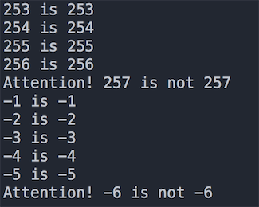
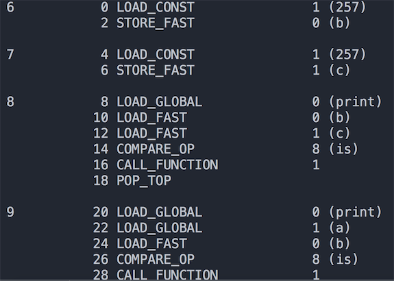
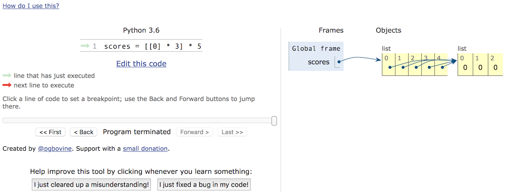

## O Yıllarda Bastığımız Tuzaklar

> **Translated to Turkish by** himmetcanumutlu

### Tuzak 1 - Tam Sayı Karşılaştırma Tuzağı

Python'da her şey nesnedir; tam sayı da nesnedir; iki tam sayıyı karşılaştırırken `==` ve `is` olmak üzere iki operatör vardır; aralarındaki fark şudur:

- `is`, iki tam sayı nesnesinin id değerinin eşit olup olmadığını, yani iki referansın bellekte aynı adresi temsil edip etmediğini karşılaştırır.
- `==`, iki tam sayı nesnesinin içeriğinin eşit olup olmadığını karşılaştırır; `==` kullanıldığında aslında nesnenin `__eq__()` yöntemi çağrılır.

`is` ile `==` arasındaki farkı bildiğimize göre, Python'da tam sayı karşılaştırmanın tuzaklarını anlamak için aşağıdaki koda bakalım; **CPython yorumlayıcısını örnek alarak**, önce aşağıdaki koda bakın.

```Python
def main():
	x = y = -1
	while True:
		x += 1
		y += 1
		if x is y:
			print('%d is %d' % (x, y))
		else:
			print('Attention! %d is not %d' % (x, y))
			break
			
	x = y = 0
	while True:
		x -= 1
		y -= 1
		if x is y:
			print('%d is %d' % (x, y))
		else:
			print('Attention! %d is not %d' % (x, y))
			break


if __name__ == '__main__':
	main()
```

Yukarıdaki kodun çalışma sonucunun bir kısmı aşağıdaki şekilde gösterilmiştir. Bu sonuç, CPython'un performans optimizasyonu amacıyla sık kullanılan tam sayı nesnelerini `small_ints` adlı bir nesne havuzunda önbelleğe almasından kaynaklanır. `small_ints` önbelleğinin tam sayı değeri aralığı `[-5, 256]` olarak belirlenmiştir; yani CPython yorumlayıcısı kullanılıyorsa, bu tam sayılara referans veren hiçbir yerde `int` nesnesi yeniden oluşturulmaz, doğrudan önbellek havuzundaki nesneye referans verilir. Tam sayı bu aralıkta değilse, iki tam sayının değeri aynı olsa bile farklı nesnelerdir.



Elbette yalnızca bu kadar olsaydı bu tuzak söz etmeye değmezdi; yukarıdaki kuralı anladıysanız, bir de aşağıdaki koda bakalım.

```Python
a = 257


def main():
	b = 257  # 6. satır
	c = 257  # 7. satır
	print(b is c)  # True
	print(a is b)  # False
	print(a is c)  # False


if __name__ == "__main__":
	main()
```

Programın çalışma sonucu kodun üzerine yorum olarak yazılmıştır. Yeterince tuzaklı değil mi! Görünüşe göre `a`, `b` ve `c`'nin değerleri aynıdır, ama `is` işleminin sonucu farklıdır. Neden böyle bir sonuç çıkıyor? Önce Python programındaki kod bloğundan bahsedelim. Kod bloğu, programın en küçük temel yürütme birimidir; bir modül dosyası, bir fonksiyon gövdesi, bir sınıf ve etkileşimli komuttaki tek satırlık kod birer kod bloğudur. Yukarıdaki kod iki kod bloğundan oluşur; `a = 257` bir kod bloğudur, `main` fonksiyonu ise başka bir kod bloğudur. CPython alt katmanı, performansı daha da artırmak için bir ayar daha yapmıştır: aynı kod bloğunda, değeri `small_ints` önbellek aralığında olmayan tam sayılar için, aynı kod bloğunda zaten aynı değerde bir tam sayı nesnesi varsa doğrudan o nesneye referans verilir, aksi halde yeni `int` nesnesi oluşturulur. Dikkat etmenizi istediğim nokta, bu kuralın sayısal türler için geçerli olduğu, ancak string için string'in uzunluğunun da dikkate alınması gerektiğidir; bunu kendiniz kanıtlayabilirsiniz.
Az önceki sonucu doğrulamak için, `dis` modülünü (adından da anlaşılacağı gibi tersine derleme yapan modül) ödünç alıp bu koda bayt kodu açısından bakabiliriz. Bayt kodunun ne olduğunu anlamıyorsanız, önce [《Python Programının Çalışma İlkesi Üzerine》]((http://www.cnblogs.com/restran/p/4903056.html)) yazısına bakabilirsiniz. Önce `import dis` ile `dis` modülünü içe aktarın ve aşağıdaki gibi kodu değiştirin.

```Python
import dis

dis.dis(main)
```

Kodun çalışma sonucu aşağıdaki şekilde gösterilmiştir. Görüldüğü gibi kodun 6. ve 7. satırları, yani `main` fonksiyonundaki 257 aynı konumdan yüklenmiştir; bu nedenle aynı nesnedir; kodun 9. satırındaki `a` ise açıkça farklı bir yerden yüklenmiştir; bu nedenle farklı nesneye referans verir.



Bu sorunu daha da derinlemesine incelemek isterseniz, [《Python Tam Sayı Nesnesi Uygulama İlkesi》](https://foofish.net/python_int_implement.html) yazısını okumanızı öneririz.

### Tuzak 2 - İç İçe Liste Tuzağı

Python'da liste adlı yerleşik bir veri türü vardır; bir kapsayıcıdır, başka nesneleri (tam olarak söylemek gerekirse başka nesnelerin referanslarını) taşımak için kullanılabilir; listedeki nesnelere listenin elemanı denir; açıkça görüldüğü gibi listeyi listenin elemanı olarak koyabiliriz; işte bu, iç içe listedir. İç içe liste; gerçek hayattaki tabloyu, matrisi, 2D oyunların haritasını (bitkiler zombilere karşı oyunundaki bahçe gibi), satranç tahtasını (satranç, Reversi gibi) vb. simüle edebilir. Ancak iç içe liste kullanırken dikkatli olun; aksi halde çok utandırıcı durumlarla karşılaşabilirsiniz; aşağıda küçük bir örnek var.

```Python
names = ['关羽', '张飞', '赵云', '马超', '黄忠']
subjs = ['Türkçe', 'Matematik', 'İngilizce']
scores = [[0] * 3] * 5
for row, name in enumerate(names):
    print('%s adlı öğrencinin notunu girin' % name)
    for col, subj in enumerate(subjs):
        scores[row][col] = float(input(subj + ': '))
        print(scores)
```

5 öğrencinin 3 dersinin notunu girmek istiyoruz; bu nedenle 5 elemanlı bir liste tanımladık; listedeki her eleman da 3 elemandan oluşan bir listedir; böyle bir listenin listesi bir tabloya birebir karşılık gelir; 5 satır 3 sütuna eşdeğerdir; ardından iç içe for-in döngüsüyle her öğrencinin 3 dersinin notunu giriyoruz. Program çalışması tamamlandığında, her öğrencinin 3 dersinin notunun birebir aynı olduğunu ve bunun da en son girilen öğrencinin notu olduğunu görürüz.

Bu tuzağı doldurmak için önce nesne ile nesnenin referansı kavramlarını ayırt etmemiz gerekir; bu iki kavramı ayırt etmek için de bellektekki yığın (stack) ve öbekten (heap) bahsetmemiz gerekir. İnsanların "yığın-öbek" sözcüğünü sıkça kullandığını duyarız; ama aslında "yığın" ve "öbek" iki farklı kavramdır. Bilindiği gibi bir program çalışırken veri ve kodu saklamak için bir miktar bellek alanı kullanır; bu bellek mantıksal olarak daha da bölümlenebilir. Alt katman dillerini (C gibi) bilen programcıların çoğu, programda kullanılabilen belleğin mantıksal olarak beş bölüme ayrılabileceğini bilir; adrese göre yüksekten düşüğe sırasıyla: yığın (stack), öbek (heap), veri bölümü (data segment), salt okunur veri bölümü (static area) ve kod bölümü (code segment). Bunlardan yığın, yerel ve geçici değişkenler ile fonksiyon çağrısı sırasında ortamı korumak ve geri yüklemek için gereken veriyi saklar; bu bellek bölümü kod bloğu çalışmaya başladığında otomatik ayrılır, kod bloğu çalışması bitince otomatik serbest bırakılır, genellikle derleyici tarafından otomatik yönetilir; öbeğin boyutu sabit değildir, dinamik olarak ayrılıp geri alınabilir; bu nedenle programda işlenecek çok veri varsa bu veriler genellikle öbeğe konur; öbek alanı doğru biçimde serbest bırakılmazsa bellek sızıntısı sorununa yol açar; Python, Java gibi programlama dilleri ise otomatik bellek yönetimini gerçekleştirmek için (artık kullanılmayan öbek alanını otomatik geri almak için) çöp toplama mekanizmasını kullanır. Dolayısıyla aşağıdaki kodda `a` değişkeni gerçek nesne değildir; nesnenin referansıdır; nesnenin öbekteki adresini kaydetmeye eşdeğerdir; bu adres aracılığıyla karşılık gelen nesneye erişebiliriz; aynı şekilde `b` değişkeni liste kapsayıcısının referansıdır; öbekteki liste kapsayıcısına referans verir; liste kapsayıcısı ise gerçek nesneyi saklamaz, yalnızca nesnenin referansını saklar.

 ```Python
a = object()
b = ['apple', 'pitaya', 'grape']
 ```

Bunu bildiğimize göre az önceki programa dönüp bakalım; listeye `[[0] * 3] * 5` işlemini uyguladığımızda yalnızca `[0, 0, 0]` listesinin adresini kopyaladık, yeni liste nesnesi oluşturmadık; bu nedenle kapsayıcıda 5 eleman olsa da bu 5 eleman aynı liste nesnesine referans verir; bu, `id` fonksiyonuyla `scores[0]` ve `scores[1]`'in adresini kontrol ederek doğrulanabilir. Dolayısıyla doğru kod aşağıdaki gibi değiştirilmelidir.

```Python
names = ['关羽', '张飞', '赵云', '马超', '黄忠']
subjs = ['Türkçe', 'Matematik', 'İngilizce']
scores = [[]] * 5
for row, name in enumerate(names):
    print('%s adlı öğrencinin notunu girin' % name)
    scores[row] = [0] * 3
    for col, subj in enumerate(subjs):
        scores[row][col] = float(input(subj + ': '))
        print(scores)
```

veya

```Python
names = ['关羽', '张飞', '赵云', '马超', '黄忠']
subjs = ['Türkçe', 'Matematik', 'İngilizce']
scores = [[0] * 3 for _ in range(5)]
for row, name in enumerate(names):
    print('%s adlı öğrencinin notunu girin' % name)
    scores[row] = [0] * 3
    for col, subj in enumerate(subjs):
        scores[row][col] = float(input(subj + ': '))
        print(scores)
```

Bellek kullanımını çok iyi anlamıyorsanız, [PythonTutor sitesinin](http://www.pythontutor.com/) sağladığı kod görselleştirme yürütme işlevine bakabilirsiniz; görselleştirme yürütmeyle belleğin nasıl ayrıldığını görebilir, böylece iç içe liste kullanırken veya nesne kopyalarken karşılaşılabilecek tuzaklardan kaçınabilirsiniz.




### Tuzak 3 - Erişim Belirteci Tuzağı

Python ile nesne yönelimli programlama yapmış olanlar bilir: Python'un sınıfı iki tür erişim denetimi sağlar; biri açık (public), biri özel (private; öznitelik veya yöntemin önüne çift alt çizgi eklenir). Java veya C# gibi dillere alışkın olanlar bilir: sınıftaki öznitelikler (veri soyutlaması) genellikle özeldir; amacı veriyi korumaktır; sınıftaki yöntemler (davranış soyutlaması) genellikle açıktır; çünkü yöntem, nesnenin dış dünyaya sunduğu hizmettir. Ancak Python, özel üyenin gizliliğini söz dizimi seviyesinde garanti etmez; çünkü yalnızca sınıftaki sözde özel üyelere adlandırma dönüşümü uygular; adlandırma kuralını biliyorsanız özel üyeye yine doğrudan erişebilirsiniz; aşağıdaki koda bakın.

```Python
class Student(object):

    def __init__(self, name, age):
        self.__name = name
        self.__age = age

    def __str__(self):
        return self.__name + ': ' + str(self.__age)


stu = Student('骆昊', 38)
print(stu._Student__name)
print(stu._Student__age)
```

Python neden böyle bir ayar yapmıştır? Bu soruyu açıklamak için yaygın bir özdeyiş kullanılır: "We are all consenting adults here" (Burada hepimiz rıza gösteren yetişkinleriz). Bu cümle, birçok Python programcısının ortak görüşünü ifade eder: Açıklık kapalılıktan iyidir; veriye veya yönteme erişimi dil seviyesinde kısıtlamak yerine davranışlarımızdan kendimiz sorumlu olmalıyız.

Dolayısıyla Python'da sınıftaki öznitelik veya yöntemleri çift alt çizgiyle başlayan özel üyelere dönüştürmenin hiçbir gerçek anlamı yoktur. Öznitelik veya yöntemi korumak isterseniz, tek alt çizgiyle başlayan korumalı üyeler kullanmanızı öneririz; bunlar da bu öznitelik veya yöntemleri gerçekten koruyamasa da, çağırana bunun doğrudan erişilmemesi gereken bir öznitelik veya yöntem olduğuna dair bir ima verir; üstelik bu, alt sınıfın bu şeyleri kalıtımla almasını etkilemez.

Hatırlatmak istediğim nokta: Python sınıfındaki `__str__`, `__repr__` gibi sihirli yöntemler özel üye değildir; çift alt çizgiyle başlasalar da çift alt çizgiyle de biterler; bu adlandırma özel üyenin adlandırması değildir; bu nokta yeni başlayanlar için gerçekten çok tuzaklıdır.
